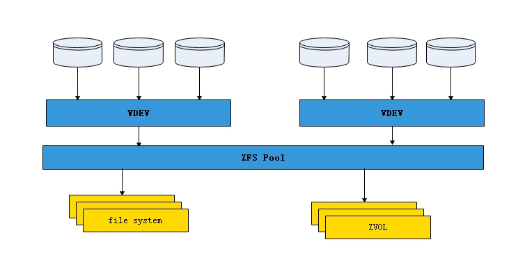

# 理解ZFS

本文将带你了解 `ZFS` 中的一些机制和功能，帮助你快速地理解 `ZFS`.

**注意:** 本篇文章介绍的原理可能比较硬核抽象, 实际上我自己都没搞太懂, 已经在尽力给大家写明白了, 如果有懂的可以帮忙完善下, 大家读不懂跳着读就行了, 不清楚运行原理应该不影响日常的使用.

即使你读不懂原理, 但是你至少得理解下文中 `概述` 和 `低级储存的内容`, 这是 `zfs` 运行时最基本的原理, 在以后的实践中我们需要它.

## 概述
`ZFS` 是对传统存储堆栈的重新思考。 `ZFS` 中的基本存储单元是 `池(pool)`，我们从池中获取 `数据集(datasets)`, 并将其作为可挂载的 `文件系统(file_system)`(类似于 `ext4`, `NTFS` 等等) 亦或是 `块设备`.  
ZFS 池是一个完整的存储堆栈，能够替换 `RAID`、`分区`、`卷管理(LVM)`、`fstab/exports` 文件和单硬盘传统文件系统, 例如 UFS 和 XFS。 这允许使用更少的代码、更高的可靠性和简化的管理来完成相同的任务。

`ZFS` 能够只用一个命令来创建一个具有冗余功能的文件系统, 并且在重启之后依然存在，这是因为 `ZFS` 在创建 `数据池` 时将自动挂载其内置的 `数据集`.

`ZFS` 本身由三个原则层组成：
- 底层是存储池分配器，它负责将物理磁盘组织到存储中
- 中间层是数据管理单元，它以原子方式事务性地读取和写入 `SPA`
- 顶层是数据集层，它将文件系统和池提供的块设备 ( `zvol` ) 上的操作转换为 `DMU` 中的操作。

### 低级存储
`SPA` 将池中的磁盘组织为 `vdev(virtual device)` 树， 树的顶层是 `top-level-vdev`， 它的直接子节点可以是除自身之外的任何 `vdev` 类型。  

`vdev` 的主要类型是：
- 镜像（支持多路镜像）
- raidz
- raidz1（1个磁盘奇偶校验，类似于 `RAID-5`）
- raidz2（2磁盘奇偶校验，类似于 `RAID-6`）
- raidz3（3磁盘奇偶校验，无 RAID 模拟）
- 磁盘
- 文件（不推荐用于生产，因为在文件系统中添加了不必要的分层）

`top-level-vdev`(顶级 `vdev`) 的子项可以是任意数量被以上所列举的项目。此外，其中一些子项可能还有子项，例如 `mirror-vdevs` 和 `raidz-vdevs`。命令行工具不支持从`mirrors(镜像)`制作`readz`，或者是从 `readz` 制作 `mirrors`，尽管此类配置用于开发人员测试。

使用多个 `top-level-vdev` 将以加法方式影响 `IOPS`，其中总 `IOPS` 将是所有`top-level-vdev` 速度的总和。 因此，任何主要 `top-level-vdev` 的丢失将导致整个池的丢失，因此必须在所有 `top-level-vdev` 上使用适当的冗余。

支持的最小 `file-vdev` 或 `disk-vdev` 大小为 64MB（2^16 字节），而最大的取决于平台，但所有平台都应支持至少 16EB（2^64 字节）的 `vdev`。

此外，还有三种特殊类型：
- `spare`(备用空间)
- `cache`(缓存)
- `log`(日志)

备用空间(`spare`)用于在驱动器发生故障时进行更换，前提是已启用池的自动替换属性并且您的平台支持该功能。它不会替换缓存设备或日志设备。

缓存设备(`cache`)用于扩展 `ZFS` 的内存数据缓存，它取代了页面缓存(`mmap`除外) `ZFS` 使用的算法是`Adaptive-Replacement-Cache(自适应复位缓存)` 算法，它的命中率比页缓存使用的 `Last(最近使用)` 算法更高。缓存设备旨在与闪存设备(比如高速SSD)一起使用。存储在其中的数据是非持久性的，因此可以使用便宜(只要快就完事了)的设备。

日志设备(`log`)允许将 `ZFS` 的意图日志记录写入不同的设备，例如闪存设备，以在将它们写入主存储之前提高同步写入操作的性能，除非设置了 `sync=disabled` 数据集属性，否则将使用这些记录。在任何一种情况下，同步操作的更改都保存在内存中，直到它们在下一个事务组提交时写出。只要下一个事务组提交成功完成，`ZFS` 就可以在丢失日志设备的情况下继续存在。 如果在日志默认丢失时系统崩溃，则池将发生故障。虽然可以恢复，但当前事务组中所做的任何同步更改都将丢失到存储在其上的数据集。

> 译者注：此段内容大致就是 `ZFS` 将一些数据内容记录到 `log` 中作为缓存和防崩溃的功能，在同步写入大量数据时，ZFS 可以先做记录但是不完整地写入数据，优先将所有同步请求返回之后再完整地写入数据，以达到提高写入速度的目的。同时，在写入时系统断电的情况下，log设备可以帮助完整地恢复写入之前的文件。

### 数据完整性
`ZFS` 有多种机制来尝试保证数据的完整性：

- 提交的数据存储在 `merkle-tree(默克尔树)` 中，该树在每个事务组提交时自动更新  
`merkle-tree` 使用存储在块指针中的 256 位`checksums(校验码)` 来防止错误的写入，包括那些可能因较弱的校验和而发生冲突的写入。 `sha256` 是被支持的加密算法(默认值为 fletcher4)， 用于更加高级和防撞的验证。
每个 \[磁盘/文件/vdev\] 包含四个磁盘标签（`disk-labels`)，每端两个，保证由于磁头掉落而导致任一端的数据丢失时仍有可用的标签存在。  

事务组提交通过两个阶段来确保在考虑提交事务组之前将所有数据写入存储。这就是 `ZFS` 在每个磁盘的每一端都有两个标签的原因。机械存储需要全头扫描(`head-sweep`)来执行事务组提交，并使用刷新来确保后半部分不会发生在其他任何事情之前(意思应该是指确保写入顺序正确？)。

存储同步 IO 更改的 ZIL 记录是自校验和块，如果系统在最后一个事务组提交之前进行了更改，则只能在池导入时读取这些块。

`ZIL` 记录了储存中的变更，来确保同步IO请求的校验块在事务提交之前系统又做出了更改时是只读的。
> 译者注：上面这段属实不知道该怎么翻译，原文如下：
> ZIL records storing changes to be made for synchronous IO are self checksumming blocks that are read only on pool import if the system made changes before the last transaction group commit was made.

默认情况下，所有元数据都会被存储两次，同时标签指向的给定事务组中池状态的对象会被写入三次。努力将元数据存储在磁盘的至少 1/8 之间，以便磁头掉落不会导致不可恢复的损坏。
标签包含一个 `超级区块(uberblocks)` 的历史，它允许在最坏的情况下将整个池回滚到最近的某个点。使用这种恢复机制需要特殊的命令，因为它不应该被需要（意思是遇到这种事情你脸真黑）。

`超级区块` 包含所有 `vdev-GUID` 的总和。`超级区块` 仅在总和匹配时才被视为有效。这可以防止被删除(`destroy`)的旧池的 `超级区块` 被误认为是有效的 `超级区块`。

因为支持 `多路镜像` 和最多 `3个级别` 的 `raidz` 奇偶校验，所以在使用适当的冗余时，出现常见的两个磁盘故障[\[1\]](https://queue.acm.org/detail.cfm?id=1670144)时，在恢复时终止 `RAID-5` 和双镜像也不会终止 `ZFS` 池。
> 原文：N-way mirroring and up to 3 levels of parity on raidz are supported so that increasingly common 2-disk failures[\[1\]](https://queue.acm.org/detail.cfm?id=1670144) that kill RAID 5 and double mirrors during recovery do not kill a ZFS pool when proper redundancy is used.

在 `FreeNAS` 论坛上流传，当不使用 `ECC内存` 时，`ZFS` 数据的数据校验功能在某种程度上比其他文件系统更差 [\[2\]](https://forums.freenas.org/index.php?threads/ecc-vs-non-ecc-ram-and-zfs.15449/)。 这已被彻底揭穿[\[3\]](http://jrs-s.net/2015/02/03/will-zfs-and-non-ecc-ram-kill-your-data/)。 但是，所有软件都需要 `ECC-内存`[\[4\]](http://open-zfs.org/wiki/Hardware#ECC_Memory) 才能可靠运行，`ZFS` 在这方面与任何其他文件系统没有什么不同。
> 译者注：听君一席话，如听君一席话

## 启动过程

### 在传统的POSIX系统上，启动过程如下：
1. `CPU` 开始执行 `BIOS`  
2. `BIOS` 将初始化基本的硬件并加载引导加载程序  
3. 引导加载程序将加载内核并传递有关包含 `rootfs` 的驱动器的信息  
4. 内核将进行额外的初始化，挂载 `rootfs` 并启动 `/sbin/init`  
5. `/sbin/init` 将启动其他一切的脚本, 这包括从 `fstab` 挂载文件系统和导出 NFS 共享  

这方面有可以有一些变化。例如，引导加载程序也可以通过 `Illumos`（通过 boot_archive）和 FreeBSD（单独）加载内核模块。 一些 Linux 系统会加载一个 `initramfs`，它是一个临时的 `rootfs`，它包含加的载模块并将引导过程的一些逻辑移动到用户空间，从而挂载真正的 `rootfs` 并通过称为 `pivot_root` 的操作切换到它。 此外，EFI 系统能够直接加载操作系统内核，从而无需引导加载程序阶段。
> 原文：
> There are some variations on this. For instance, the bootloaders will also load kernel modules on Illumos (via a boot_archive) and FreeBSD (individually). Some Linux systems will load an initramfs, which is an temporary rootfs that contains modules to load and moves some logic of the boot process into userland, mounts the real rootfs and switches into it via an operation called pivot_root. Also, EFI systems are capable of loading operating system kernels directly, which eliminates the need for the bootloader stage.

### ZFS 对引导过程进行了以下更改：
当 `rootfs` 在 `ZFS` 上时，必须先导入`pool(池)`中，然后内核才能挂载它。 `Illumos` 和 `FreeBSD` 上的引导加载程序会将 `池` 信息传递给内核，以便内核导入`root-pool(根池)` 并挂载 `rootfs`.  
在 Linux 上，必须使用 `initramfs`，直到编写了对动态创建 `initramfs` 的引导加载程序的支持。

不管有没有 `根池`，都必须出现被导入的 `池`。 这是通过从 `zpool.cache` 文件中读取导入池列表来完成的，该文件位于大多数平台上的 `/etc/zfs/zpool.cache`。 它位于 FreeBSD 上的 `/boot/zfs/zpool.cache`。 它存储为 `XDR` 编码的 `nvlist`，可以通过执行不带参数的 `zdb` 命令来读取。

导入 `池` 后，必须挂载文件系统，并且必须进行任何文件系统导出或 `iSCSI-LUN`。 如果数据集的 `mountpoint` 属性设置为 `legacy`，则可以使用 `fstab`。 否则，引导脚本将在池导入后通过运行 `zfs mount -a` 来挂载数据集。 类似地，在挂载完成后，通过文件系统的 `NFS` 或 `SMB` 和 `zvol` 的 `iSCSI` 共享的任何数据集都将通过`zfs share -a` 导出或共享。 并非所有平台都支持所有共享类型的 `zfs share -a`。 传统方法可能总是被使用，并且必须在不支持通过 `zfs share -a` 实现自动化的平台上使用。

下表显示了在各种平台上 `zfs share -a` 支持哪些协议：
|   平台   |  isCSI  |   NFS   |  SMB  |
| -------- | ------- | ------- | ----- |
|  FreeBSD |    ×    |    √    |   ×  |
|  Illumos |    √    |    √    |   √  |
|  Linux   |    ×    |    √    |   √  |
|  MacOSX  |    ×    |    ×    |   ×  |
|  OSv     |    ×?   |    ×?   |   ×? |

## 池(pool)的创建
ZFS 的管理是通过 `zpool` 和 `zfs` 命令执行的。 要创建池，您可以使用 `zpool create [poolname] [...]`。 `poolname` 后面的部分是 `vdev树` 的规范（参数）。除非使用 `zpool create -m none`，根数据集将默认挂载在 `/poolname`。 其他挂载点位置可以通过将它们写入代替 `none` 来指定。

> 译者注:  
> 关于创建储存池的内容，[详见此](https://my.oschina.net/u/2306127/blog/2250662)

在指定 `顶级 vdev(top-level-vdev)` 关键字之前的任何 文件或磁盘vdev 都将是 顶级vdev。  顶级vdev 关键字之后的任何内容都将是该 vdev 的子项。 顶级 vdev 中大小不等的磁盘或文件会将其存储限制为两者中较小的一个。 对于部署于生产环境的池，重要的是不要创建不是 raidz、镜像、日志、缓存或备用 vdev 的顶级 vdev。

其他信息可以在您平台上的 zpool 手册页中找到。 这是关于 Illumos 的第 1m 节和关于 Linux 的第 8 节。

## 重要信息
### 扇区对齐
`ZFS` 将尝试通过从磁盘中提取物理扇区大小来确保正确对齐。 每个顶级 vdev 将使用最大的扇区大小，以避免部分扇区修改开销被消除。 当驱动器误报其物理扇区大小时，这将是不正确的。 [性能调优](https://openzfs.github.io/openzfs-docs/Performance%20and%20Tuning/Workload%20Tuning.html)页面解释了更多。

### 调整整个磁盘
当提供整个磁盘时，ZFS 还将尝试在各种平台上进行细微的调整。 在 Illumos 上，ZFS 将启用磁盘缓存以提高性能。 It will not do this when given partitions to protect other filesystems sharing the disks that might not be tolerant of the disk cache, such as UFS.（不知道怎么翻译）  
在 Linux 上，IO 电梯将设置为 noop 以减少 CPU 开销。 ZFS 有自己的内部 IO 电梯，这使得 Linux 电梯变得多余。 [性能调优](https://openzfs.github.io/openzfs-docs/Performance%20and%20Tuning/Workload%20Tuning.html)页面解释了更多。

### 驱动器错误恢复控制
`ZFS` 目前没有做的一项重要调整是调整驱动器上的错误恢复控制。 当驱动器遇到读取错误时，它会重试读取，希望从稍微不同的角度读取会成功并允许它正确地重写扇区。 它会重复这样做直到达到超时，在许多驱动器上通常为 7 秒。 在此期间，驱动器可能不会为其他 IO 请求提供服务，这会对 IOPS 产生严重影响，因为事务组提交将等待所有 IO 完成，然后才能开始下一次。 在更改 ZFS 以在它控制的磁盘上设置此设置之前，系统管理员应该使用 smartctl 和系统本地文件等工具在每次启动时执行此操作。

### \[驱动器/驱动器控制器\]挂起
以类似的方式，如果驱动器或驱动器控制器挂起，它将挂起池，并且将触发死机计时器。 在 `Illumos` 上，这将触发系统重启。 在 `Linux` 上，这将尝试记录失败，但不执行任何其他操作。 Deadman 计时器的默认超时时间为 1000 秒。

### 硬件
ZFS 旨在使用商品硬件来可靠地存储数据，但是某些硬件配置本身就很不可靠，以至于没有文件系统可以对其进行补偿。 有关硬件配置的建议可以在[硬件页面](https://openzfs.github.io/openzfs-docs/Performance%20and%20Tuning/Hardware.html)上找到。

### 硬件 RAID 阵列
硬件 RAID 不应与 ZFS 一起使用。 可以在[硬件页面](https://openzfs.github.io/openzfs-docs/Performance%20and%20Tuning/Hardware.html)上找到原因的解释。

### 性能
ZFS 是自调整的，但有一些调整可以使某些应用程序受益。 这些在[性能调优](https://openzfs.github.io/openzfs-docs/Performance%20and%20Tuning/Workload%20Tuning.html)页面上进行了描述。

### 冗余
两个磁盘出现故障的情况很常见[\[5\]](https://queue.acm.org/detail.cfm?id=1670144)，因此 `raidz1-vdevs` 不应用于生产中的数据存储。 `2-disk` 镜像也有风险，但不会像 `raidz1-vdevs` 那么多，除非只使用两个磁盘。 这是因为`2-disk` 镜像中所有磁盘的故障在统计上比奇偶校验配置（如 raidz1）中只有 2 个磁盘发生故障的可能性要小，除非仅使用 2 个磁盘，否则两者故障风险是相同的。 同样的风险也适用于 `RAID-1` 和 `RAID-5`

不应在生产中使用单磁盘虚拟设备（不包括日志和缓存设备），因为它们不是冗余的。 但是，可以通过 `zpool attach` 附加磁盘将磁盘转换为镜像，从而使包含单个磁盘 vdev 的池变得冗余。

## 常规管理
使用 `zpool` 命令在 `池` 级别执行常规管理，使用 `zfs` 命令在 `数据集` 级别执行常规管理。 文档可以在您平台的相应 zpool 和 zfs 手册页中找到。 它们位于关于 Linux 的第 8 节和关于 Illumos 的第 1m 节。

有关某些手册页的链接，请参阅平台/分发文档。 请注意，一个平台的手册页可能与其他平台相关。

## 其他资源
### 第三方工具
- [bdrewery/zfstools](https://github.com/bdrewery/zfstools) 提供快照管理工具。 它是用 `ruby` 写的。
- [fearedbliss/bliss-zfs-scripts](https://github.com/fearedbliss/bliss-zfs-scripts) 提供 MPL 2.0 下的“ZFS 快照和备份管理”工具。 专为 Gentoo Linux 设计。
- [jimsalterjrs/sanoid](https://github.com/jimsalterjrs/sanoid) GPL 下的策略驱动快照管理和复制工具。 针对 Linux 和 FreeBSD 进行了测试。
- [Rudd-O/zfs-tools](https://github.com/Rudd-O/zfs-tools) 提供了快照管理和复制的工具。 它是用python编写的。
- [ZFS Watcher](http://zfswatcher.damicon.fi/) 是一个池监控和通知守护进程。

## Platform/Distribution documentation

### FreeBSD

- Manual pages: [zdb](http://www.freebsd.org/cgi/man.cgi?query=zdb&manpath=FreeBSD+8.4-RELEASE) | [zfs](http://www.freebsd.org/cgi/man.cgi?query=zfs&manpath=FreeBSD+8.4-RELEASE) | [zpool](http://www.freebsd.org/cgi/man.cgi?query=zpool&manpath=FreeBSD+8.4-RELEASE) | [zpool-features](http://www.freebsd.org/cgi/man.cgi?query=zpool-features&manpath=FreeBSD+8.4-RELEASE) | [zstreamdump](http://www.freebsd.org/cgi/man.cgi?query=zstreamdump&manpath=FreeBSD+8.4-RELEASE)
- [ZFS Chapter](https://www.freebsd.org/doc/en_US.ISO8859-1/books/handbook/zfs.html) of *The FreeBSD Handbook*
- [FreeBSD ZFS Wiki](https://wiki.freebsd.org/ZFS)

### Gentoo

- [Wiki page](https://wiki.gentoo.org/wiki/ZFS)
- [Richard Yao's Gentoo installation notes](https://github.com/ryao/zfs-overlay/blob/master/zfs-install)

### illumos

- Manual pages: [zdb](http://www.illumos.org/man/1m/zdb) | [zfs](http://illumos.org/man/1m/zfs) | [zpool](https://www.illumos.org/man/1M/zpool) | [zpool-features](https://www.illumos.org/man/5/zpool-features) | [zstreamdump](http://illumos.org/man/1m/zstreamdump)
- [Wiki page](http://wiki.illumos.org/display/illumos/ZFS)
- OpenIndiana [ZFS Administration Guide](http://wiki.openindiana.org/oi/ZFS)

